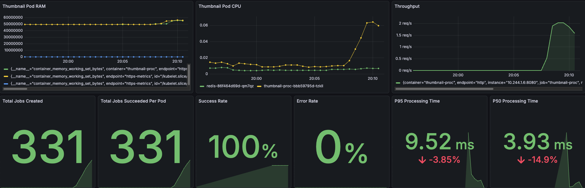
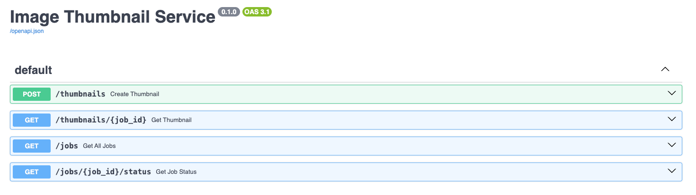
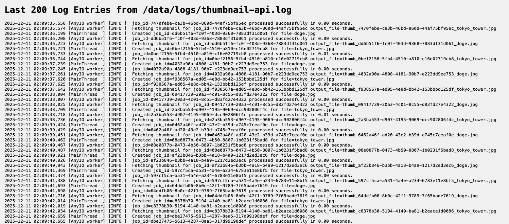

# ImageLabs

Thumbnail creation assignment

A user submits an image to an API endpoint. \
The API will:

- Save the original image
- Initiate long-running background job to generate a 100x100 thumbnail
- Return a job ID to the user

The user can:

- Check job status (processing, succeeded, failed)
- Fetch the thumbnail once completed
- List all submitted jobs
- Access debugging logs, metrics, and monitoring data

## Usage

- Thumbnail Processor OpenAPI Docs: http://localhost:30080/docs
- Metrics Exposure: http://localhost:30080/metrics
- Prometheus: http://localhost:9090
- Grafana Dashboard: http://localhost:3000
  - Pre-made dashboard configmap "Thumbnail Processing Stats"
- Image Processing Logs: http://localhost:30080/logs

## Reasoning

This system is designed to simple, observable, and reliable. FastAPI handles requests, while Redis stores a central authority of job queues, (potentially) supporting multiple replicas. Prometheus and Grafana are integrated to expose throughput, latency, error rates, and pod health, without manual investigation. Automation scripts ensure the system is repeatable and easy to run for the end user.

### Limitations and considerations

Due to Kind cluster limitations with persistent volume claims, I decided to stay with emptyDir{} for thumbnail pods. This was decided purely as a limitation of reliability for Cogent review.

Since there is no PVC for replicas, the deployment will only run a single thumbnail replica. Otherwise, one pod may look for an image that does not exist on the other pod's emptyDir{}, since this is not a shareable volume between pods.

Due to complexity and overkill with running nginx or other ingress controllers, I decided to stick with NodePort for thumbnail pods (stability over kubectl port-forward:8080) and port-forwards for Prometheus and Grafana.

Logging is centralized to a single /logs endpoint. Loki was attempted to ship logs to Grafana, but ran into complication on Kind compatibility.

Test script runs a thumbnail POST > downloads generated thumbnail > deletes thumbnail. There is no ramping or distribution on this test.

Many decisions were made to ensure compatability and simplicity for Cogent reviewers, while keeping a reliable system to demonstrate. In a real cluster I would run shared elastic storage (EFS) and run multiple HPA enabled API pods behind an nginx ingress controller.

## Architecture

- FastAPI + background processing + Redis job store + Kubernetes + Prometheus/Grafana






## Automated Setup

The project includes a startup script that automates Docker builds, Kind cluster creation,
Helm installs, and optional load testing.

## start.sh does the following

- Builds the Docker image

- Creates a Kind cluster named cogent using kind-config.yaml

- Loads the image to the cluster

- Installs the thumbnail-proc Chart

- Installs the kube-prometheus-stack Chart

- Waits for Pod availability

- Outputs Grafana admin credentials and service URLs

- Port-forwards Grafana and Prometheus

- Cleans up the cluster on Ctrl-C

- **Optionally:```--smoke-test``` ```[num]```(default 10 jobs)  will run test/test.sh and output results**

### Run without Automated Testing

```bash
./start.sh
```

### Run with Automated testing (default 10 jobs)

```bash
./start.sh --smoke-test 30
```

## Manual Setup

- Build the Python FastAPI services

```docker
docker build -t thumbnail-proc:latest .
```

- Create the Kind cluster

```kind
kind create cluster --name cogent --config kind-config.yaml
```

- Load the image into the cluster

```kind
kind load docker-image thumbnail-proc:latest --name cogent
```

- Install the Thumbnail Processor Helm chart

```helm
helm upgrade --install thumbnail-proc ./helm/thumbnail-proc
```

- Install Prometheus + Grafana

```helm
helm repo add prometheus-community https://prometheus-community.github.io/helm-charts
helm repo update
```

```helm
helm install monitoring prometheus-community/kube-prometheus-stack \
  --namespace monitoring --create-namespace \
  -f values-prometheus.yaml
```

- Port forward services

```kubectl
kubectl port-forward -n monitoring svc/monitoring-grafana 3000:80 &
kubectl port-forward -n monitoring svc/monitoring-kube-prometheus-prometheus 9090:9090
```

- Retrieve Grafana admin password

```bash
kubectl --namespace monitoring get secrets monitoring-grafana -o jsonpath="{.data.admin-password}" | base64 -d ; echo
```
